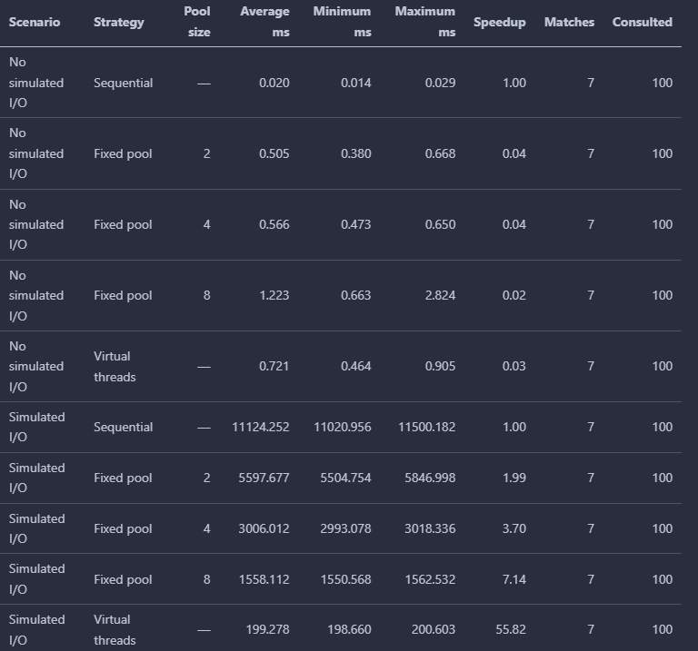
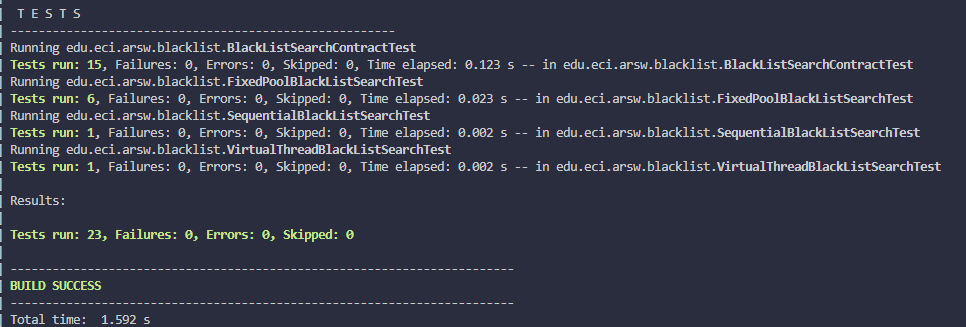
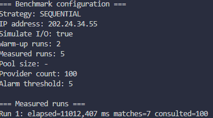
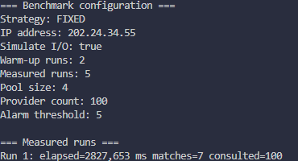
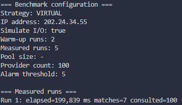
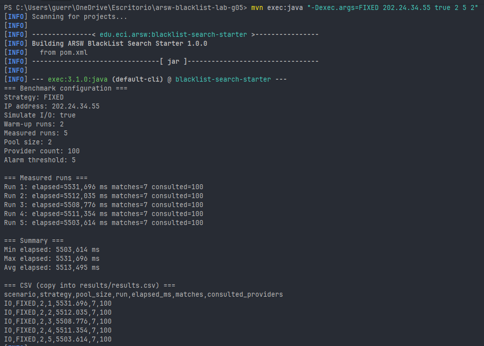
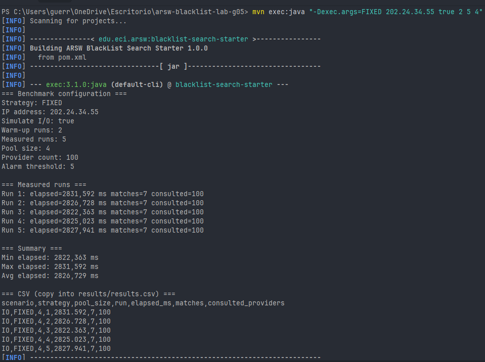
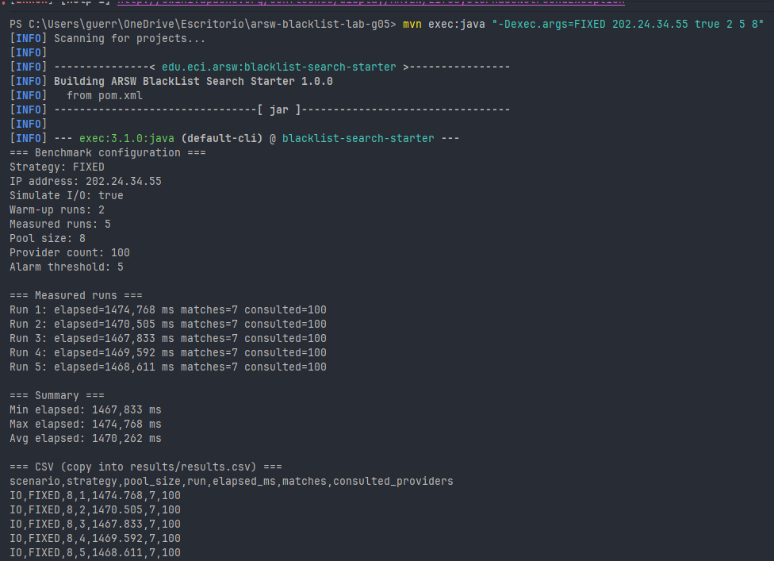

# ARSW — Blacklist Concurrency Laboratory

> **Java 21 laboratory on concurrency, performance measurement, fixed thread pools, and virtual threads.**

**Course:** Arquitecturas de Software — ARSW  
**Institution:** Universidad Escuela Colombiana de Ingeniería Julio Garavito  
**Professor:** Javier Iván Toquica  
**Work mode:** Teams of three students  
**Technology:** Java 21 · Maven · JUnit 5  
**Submission deadline:** Defined in the institutional platform

---

## 1. Laboratory purpose

This laboratory evaluates the implementation and experimental comparison of three strategies for consulting blacklist providers:

1. Sequential execution.
2. Concurrent execution with a fixed-size thread pool.
3. Concurrent execution with Java 21 virtual threads.

The goal is not merely to identify the fastest implementation. Each team must produce evidence to explain:

- When concurrency improves performance.
- When task coordination introduces more overhead than benefit.
- How blocking operations affect the choice of concurrency model.
- How correctness is preserved when several tasks execute concurrently.
- What architectural trade-offs exist among performance, complexity, scalability, and maintainability.

> **Correctness comes before performance.** A benchmark is invalid when the compared strategies do not produce equivalent results.

---

## 2. Relationship with Workshop 1

Workshop 1 and Laboratory 1 use the same case, but they are different activities.

### Workshop 1

- Inspect the starter project.
- Execute the sequential implementation.
- Analyze architectural decisions, quality attributes, metrics, and trade-offs.
- Do not implement the concurrent solutions.

### Laboratory 1

- Implement the missing concurrent strategies.
- Create automated tests.
- Execute a controlled benchmark.
- Analyze experimental evidence.
- Document and defend the resulting architectural recommendation.

The decision matrix completed during the workshop is **not** a laboratory deliverable. The laboratory grade is based on implementation, correctness, measurement, analysis, and repository evidence.

---

## 3. Problem statement

A system receives an IP address and asks multiple blacklist providers whether that address has been reported.

The starter project creates 100 deterministic providers. A provider can optionally simulate a blocking I/O operation by waiting for a controlled amount of time.

The supplied sequential implementation:

- Consults all providers.
- Collects the identifiers of matching providers.
- Reports the number of consulted providers.
- Measures elapsed time.
- Classifies the IP according to an alarm threshold.

The laboratory must preserve the same functional result while changing the execution strategy.

---

## 4. Starter project

The repository includes the following relevant classes:

```text
src/
├── main/
│   └── java/edu/eci/arsw/blacklist/
│       ├── BenchmarkRunner.java
│       ├── BlackListProvider.java
│       ├── BlackListSearch.java
│       ├── FixedPoolBlackListSearch.java
│       ├── MockBlackListProvider.java
│       ├── ProviderFactory.java
│       ├── SearchResult.java
│       ├── SequentialBlackListSearch.java
│       └── VirtualThreadBlackListSearch.java
└── test/
    └── java/edu/eci/arsw/blacklist/
        └── SequentialBlackListSearchTest.java
```

### Supplied implementation

`SequentialBlackListSearch` is complete and must be used as the functional baseline.

### Pending implementations

The following classes intentionally contain `TODO` work:

- `FixedPoolBlackListSearch`
- `VirtualThreadBlackListSearch`

`BenchmarkRunner` initially executes only the sequential strategy. Each team must extend it to run the required benchmark configurations.

---

## 5. Technical requirements

Before starting, verify:

```bash
java -version
mvn -version
```

Required versions:

- JDK 21.
- Maven 3.9 or later.
- Git.
- A GitHub account.

Compile and execute the supplied baseline:

```bash
mvn clean test
mvn exec:java
```

Execute the baseline with and without simulated I/O:

```bash
mvn exec:java -Dexec.args="202.24.34.55 true"
mvn exec:java -Dexec.args="202.24.34.55 false"
```

The default IP address is:

```text
202.24.34.55
```

---

## 6. Repository setup

Each team must create its own repository from this template.

Suggested repository name:

```text
arsw-blacklist-lab-gXX
```

Example:

```text
arsw-blacklist-lab-g03
```

Before modifying the code:

1. Add the three team members as collaborators.
2. Clone the team repository.
3. Verify Java 21 and Maven.
4. Run `mvn clean test`.
5. Execute the sequential baseline.
6. Create issues or tasks for the work distribution.
7. Record the baseline result in this README.

Every team member must contribute meaningful commits and must understand the complete solution.

---

# Part A — Concurrent implementation

## 7. Task 1: Fixed-size thread pool

Complete:

```text
FixedPoolBlackListSearch.java
```

The implementation must:

- Implement the `BlackListSearch` interface.
- Receive the provider list and pool size through the constructor.
- Validate that the pool size is greater than zero.
- Use `ExecutorService`.
- Create the executor with `Executors.newFixedThreadPool(poolSize)`.
- Submit provider consultations as concurrent tasks.
- Wait for all submitted tasks.
- Collect each matching provider identifier exactly once.
- Return deterministic results.
- Report the correct number of consulted providers.
- Measure elapsed time with `System.nanoTime()`.
- Close the executor correctly.
- Preserve interruption when an `InterruptedException` occurs.
- Avoid unsafe shared mutable state.

The required pool sizes are:

```text
2, 4, and 8 platform threads
```

### Implementation restrictions

The following approaches do not satisfy this task:

- Replacing the implementation with `parallelStream()`.
- Using the common `ForkJoinPool`.
- Protecting the entire search method with `synchronized`.
- Delegating the search to `SequentialBlackListSearch`.
- Removing or modifying the provider latency to improve results.
- Returning hard-coded matches.

A valid design may use tasks that return their own result and then consolidate those results after calling `Future.get()`.

---

## 8. Task 2: Java 21 virtual threads

Complete:

```text
VirtualThreadBlackListSearch.java
```

The implementation must:

- Implement the `BlackListSearch` interface.
- Use `Executors.newVirtualThreadPerTaskExecutor()`.
- Create one independent task per provider.
- Wait for all tasks to finish.
- Collect each matching provider identifier exactly once.
- Return deterministic results.
- Report the correct number of consulted providers.
- Measure elapsed time with `System.nanoTime()`.
- Close the executor correctly.
- Preserve interruption and provide meaningful error handling.
- Produce a result equivalent to the sequential baseline.

The virtual-thread implementation must not create a manually sized platform-thread pool.

---

## 9. Required result contract

For the mandatory part of this laboratory, all strategies must perform a **complete scan** of the provider list.

For the same IP address and provider configuration:

```text
Sequential result = Fixed-pool result = Virtual-thread result
```

The following values must be equivalent:

- Matching provider identifiers.
- Number of matching providers.
- Trustworthiness classification.
- Number of consulted providers.

Because concurrent tasks can finish in a different order, the returned matching provider identifiers must be ordered before constructing the final `SearchResult`.

For the supplied set of 100 providers:

```text
consultedProviders = 100
```

Early termination at five matches is not part of the mandatory implementation because it changes the amount of evidence collected. It appears only as an optional extension at the end of this document.

---

# Part B — Automated verification

## 10. Task 3: Tests

Add automated tests for the concurrent implementations.

At minimum, the test suite must verify:

1. The sequential implementation is deterministic.
2. A pool of 2 threads returns the same provider identifiers as the sequential baseline.
3. A pool of 4 threads returns the same provider identifiers as the sequential baseline.
4. A pool of 8 threads returns the same provider identifiers as the sequential baseline.
5. The virtual-thread strategy returns the same provider identifiers as the sequential baseline.
6. Every mandatory strategy reports all 100 providers as consulted.
7. Matching provider identifiers contain no duplicates.
8. Matching provider identifiers are returned in ascending order.
9. Creating a fixed-pool search with a non-positive pool size fails with `IllegalArgumentException`.
10. The project passes all tests with simulated I/O disabled.

Run:

```bash
mvn clean test
```

Tests must validate behavior, not execution speed. Do not write tests that fail because one strategy took a few milliseconds more than another.

---

# Part C — Benchmark runner

## 11. Task 4: Extend `BenchmarkRunner`

Modify `BenchmarkRunner` so that it can select the execution strategy from command-line arguments.

Use the following command contract:

```text
<strategy> <ipAddress> <simulateIo> <warmups> <measuredRuns> [poolSize]
```

Accepted strategy values:

```text
SEQUENTIAL
FIXED
VIRTUAL
```

Examples:

```bash
mvn exec:java -Dexec.args="SEQUENTIAL 202.24.34.55 true 2 5"
```

```bash
mvn exec:java -Dexec.args="FIXED 202.24.34.55 true 2 5 4"
```

```bash
mvn exec:java -Dexec.args="VIRTUAL 202.24.34.55 true 2 5"
```

The runner must:

- Validate the arguments.
- Instantiate the selected strategy.
- Execute the requested warm-up runs without including them in the results.
- Execute the requested measured runs.
- Verify that every measured run produces the expected functional result.
- Calculate minimum, maximum, and average elapsed time.
- Print the selected configuration.
- Print individual measured times.
- Print a summary suitable for copying into `results.csv`.

Recommended output fields:

```text
scenario,strategy,pool_size,run,elapsed_ms,matches,consulted_providers
```

Example row:

```text
IO,FIXED,4,1,2845.327,7,100
```

Do not use IDE timestamps or manually measured wall-clock time. Use the elapsed duration returned by the search implementation.

---

# Part D — Experimental comparison

## 12. Task 5: Benchmark methodology

Use the same computer for all measurements.

Before measuring:

- Close unnecessary applications.
- Connect the computer to power when possible.
- Avoid changing the source code between compared runs.
- Run `mvn clean test`.
- Record the execution environment.
- Use two warm-up executions.
- Use five measured executions.

Required experiment matrix:

| Scenario | Strategy | Threads or tasks |
|---|---|---:|
| Local, no simulated I/O | Sequential | 1 |
| Local, no simulated I/O | Fixed pool | 2 |
| Local, no simulated I/O | Fixed pool | 4 |
| Local, no simulated I/O | Fixed pool | 8 |
| Local, no simulated I/O | Virtual threads | 100 tasks |
| Simulated blocking I/O | Sequential | 1 |
| Simulated blocking I/O | Fixed pool | 2 |
| Simulated blocking I/O | Fixed pool | 4 |
| Simulated blocking I/O | Fixed pool | 8 |
| Simulated blocking I/O | Virtual threads | 100 tasks |

### Important interpretation

The scenario without simulated I/O performs a small local calculation. It is useful for observing coordination overhead, but it is not a complete representation of every CPU-bound workload.

The scenario with simulated I/O represents blocking calls such as network, database, or external-service requests.

Do not invent expected times. Performance depends on the execution environment.

---

## 13. Metrics

For every configuration, report:

- Average elapsed time in milliseconds.
- Minimum elapsed time.
- Maximum elapsed time.
- Number of matches.
- Number of consulted providers.
- Speedup relative to the sequential strategy in the same scenario.

Calculate speedup as:

```text
Speedup = sequential average time / strategy average time
```

Interpretation examples:

- `1.00`: no improvement relative to sequential execution.
- Greater than `1.00`: faster than the sequential baseline.
- Less than `1.00`: slower than the sequential baseline.

Do not compare a strategy executed with simulated I/O against a baseline executed without simulated I/O.

---

## 14. Required results table

Complete this table with actual measurements:

| Scenario | Strategy | Pool size | Average ms | Minimum ms | Maximum ms | Speedup | Matches | Consulted |
|---|---|---:|---:|---:|---:|---:|---:|---:|
| No simulated I/O | Sequential | — | 0.020 | 0.014 | 0.029 | 1.00 | 7 | 100 |
| No simulated I/O | Fixed pool | 2 | 0.505 | 0.380 | 0.668 | 0.04 | 7 | 100 |
| No simulated I/O | Fixed pool | 4 | 0.566 | 0.473 | 0.650 | 0.04 | 7 | 100 |
| No simulated I/O | Fixed pool | 8 | 1.223 | 0.663 | 2.824 | 0.02 | 7 | 100 |
| No simulated I/O | Virtual threads | — | 0.721 | 0.464 | 0.905 | 0.03 | 7 | 100 |
| Simulated I/O | Sequential | — | 11124.252 | 11020.956 | 11500.182 | 1.00 | 7 | 100 |
| Simulated I/O | Fixed pool | 2 | 5597.677 | 5504.754 | 5846.998 | 1.99 | 7 | 100 |
| Simulated I/O | Fixed pool | 4 | 3006.012 | 2993.078 | 3018.336 | 3.70 | 7 | 100 |
| Simulated I/O | Fixed pool | 8 | 1558.112 | 1550.568 | 1562.532 | 7.14 | 7 | 100 |
| Simulated I/O | Virtual threads | — | 199.278 | 198.660 | 200.603 | 55.82 | 7 | 100 |

Also include the raw measurements in:

```text
results/results.csv
```

Suggested repository location:

```text
results/
├── results.csv
└── environment.md
```

---

# Part E — Analysis and architectural recommendation

## 15. Task 6: Required analysis

Answer every question with evidence from the experiment.

### 15.1 Correctness

1. How did the team verify that the three strategies produce equivalent results?

   - RTA: Nosotros hicimos la verficaciones mediante pruebas automatizadas donde la respuesta base es la estrategia SEQUENTIAL, donde se prueba la misma IP, warmups y measuredRuns finalmente comparando las respuestas. Tambien, se hicieron 50 ejecuciones medidas que se registraron en results/results.csv.

   
   

2. Why can concurrent tasks return matches in a different order?

   - RTA: Para responder esta pregunta es importante distinguir entre dos conceptos: el orden de finalizacion es no deterministico por naturaleza, per el orde de recoleccion es una decision de diseño. Ambas implementaciones concurrentes cosechan los resultados recorriendo los Future en el orden en que se enviaron las tareas e invokeAl;l garantiza por contrato que devuelve los futures en el orden de la coleccion de entrada, de este modo, la variabilidad de finalizacion queda contenida dentro del executor.


   
   
   

3. What mechanism or design prevented lost or duplicated matches?

   - RTA: Para evitar las perdidas y duplicados, se elimino el estado mutable compartido donde cada proveedor se encapsula en una tarea independiente cuyo Callable devuelve su propio resultado, asi ningun hilo escribe sobre una coleccion comun evitando asi alguna condicion de carrera. La consolidacion ocurre en un solo hilo el cual invoca serch() leyendo cada future exactamente una vez con get(), al ser una relacion 1 a 1  (proveedor → tarea → Future)  se recorren todos y no se puede omitir o duplicar ninguno. 

4. Why should performance not be compared before proving functional equivalence?

   - RTA: Primero era importante comprobar que todas las estrategias dieran el mismo resultado correcto. No tendría sentido decir que una es más rápida si al mismo tiempo tiene errores de concurrencia, porque aunque se ejecute en menos tiempo, el resultado no sería confiable
   

### 15.2 Fixed thread pool

5. What changed when the pool increased from 2 to 4 threads?
   - RTA: En el escenario con I/O simulado el tiempo promedio bajo de 5513,495 ms a 2826,729 ms y el el speedup subió de 2.02 a 3.94, mostrandonos una clara mejora al duplicar los hilos al hacer esto tambien se duplican la cantidad de proveedores consultados en paralelo.

   
   

   
   
   6. What changed when the pool increased from 4 to 8 threads?
   - RTA: En el escenario con I/O simulado el tiempo promedio bajo de 2826,729 ms a 1470,262 ms y el el speedup subió de 3.94 a 7.57. La tendencia que vimos anteriormente se mantiene porque los 8 hilos siguen estando por debajo de los 16 procesadores logicos de la maquina.   
   
   
   
7. Was the improvement proportional to the number of threads? Explain.
   - RTA: Fue casi proporcional pero sublineal, De 2 a 4 hilos el tiempo pasO de 5513.495 ms a 2826.729 ms y de 4 a 8 pasó a 1470.262 ms, es decir que cada hilo adicional aporta menos que el anterior. Una causa principal es que las latencias de los proveedores van de 20 ms a 200 ms según ProviderFactory, así que el tiempo total lo define el hilo que termina último y no el promedio.
   
8. What costs are introduced by task creation, scheduling, context switching, and result consolidation?

   - RTA: El escenario sin I/O aisla esos costos, porque el trabajo util es identico al secuencial: 0.020 ms secuencial frente a 1.223 ms con pool de 8 son unos 1.2 ms de sobrecosto puro. Ese costo viene de crear los hilos de plataforma del pool, de instanciar 100 Callable y 100 FutureTask, de la contención sobre el lock de la única BlockingQueue del pool con park/unpark que rompe la localidad de caché, y de recorrer los 100 Future con get(). Con I/O simulado ese mismo 1.2 ms es despreciable frente a los 1470.262 ms medidos con 8 hilos: el sobrecosto no cambia, cambia su peso relativo.

9. What would happen if the pool size were much larger than the available platform threads?

   - RTA: Depende de la carga, con trabajo bloqueante seguiria mejorando hasta acercarse a las 100 tareas, porque un hilo dormido en Thread.sleep() no consume CPU y el limite no son los nucleos sino las esperas simultáneas; los hilos virtuales lo confirman al caer a 199.278 ms con 100 tareas concurrentes. Pero 100 hilos de plataforma son cerca de 100 MB solo en pilas, con trabajo intensivo en CPU la sobresuscripcion es perdida neta: solo hay 16 procesadores logicos y los hilos extra unicamente agregan cambios de contexto, degradacion que el escenario sin I/O ya muestra al pasar de 2 a 8 hilos. Un pool mucho mayor que los hilos disponibles indica que la herramienta correcta son los hilos virtuales.

### 15.3 Virtual threads

10. In which scenario did virtual threads provide the clearest benefit?

   RTA: En el escenario en el que vimos mas claro el beneficio de usar los virtual threads fue al hacer las 50 ejecuciones, en results/results.md donde los virtual threads promediaron 199,278ms frente a 11.124,252ms de la estrategia secuencial y frente a 1.588,112ms del mejor pool fijo (8 hilos).

   

11. Why are virtual threads especially relevant for blocking operations?

   RTA: Porque un virtual thread bloqueado no retiene un hilo del sistema operativo. Cuando ejecuta una operación bloqueante instrumentada por la JVM (Thread.sleep, I/O de red, esperas de socket), la JVM copia su pila al heap y lo desmonta de su carrier thread, dejando ese hilo plataforma libre para ejecutar otra tarea. Cuando la espera termina, el virtual thread se remonta sobre cualquier carrier disponible y continúa.

12. Why do virtual threads not make local CPU work automatically faster?

   RTA: Los virtual threads no hacen que el trabajo local de CPU sea automáticamente más rápido porque no aumentan la capacidad de procesamiento del CPU. Los virtual threads son útiles principalmente para manejar muchas tareas concurrentes, especialmente cuando las tareas pasan tiempo esperando operaciones de I/O.

13. What trade-offs remain even when virtual threads are lightweight?

   RTA: Aunque los virtual threads son ligeros, todavía introducen costos de planificación y coordinación, y las tareas intensivas en CPU siguen limitadas por los núcleos disponibles del procesador.

### 15.4 Architectural decision

14. Which strategy would the team recommend for a system dominated by blocking external calls?
15. Which strategy would the team recommend for a small local workload?
16. Under what conditions would a fixed pool still be preferable?
17. What evidence from the measurements supports the recommendation?
18. What limitations prevent generalizing the conclusion to every production system?

Answers such as “virtual threads are better” or “more threads are faster” are insufficient without conditions and evidence.

---

## 16. Architectural conclusion

Write a team conclusion of 150 to 250 words.

The conclusion must include:

- The dominant workload characteristic.
- The measured evidence.
- The recommended strategy.
- The conditions under which the recommendation is valid.
- At least one trade-off.
- At least one limitation of the experiment.

### Team conclusion

> Replace this text with the team conclusion.

---

## 17. Individual conclusions

Each student must add an individual conclusion of 80 to 120 words.

### Student 1

**Name:** Pending

> Replace this text with the individual conclusion.

### Student 2

**Name:** Pending

> Replace this text with the individual conclusion.

### Student 3

**Name:** Pending

> Replace this text with the individual conclusion.

---

# Part F — Submission

## 18. Required deliverables

The repository must contain:

- Functional sequential baseline.
- Functional fixed-thread-pool implementation.
- Functional virtual-thread implementation.
- Extended `BenchmarkRunner`.
- Automated tests.
- `results/results.csv`.
- `results/environment.md`.
- Completed results table.
- Answers to all analysis questions.
- Team architectural conclusion.
- Three individual conclusions.
- AI-use declaration.
- Meaningful Git history from all team members.

The repository must compile from a clean clone:

```bash
mvn clean test
```

---

## 19. Execution environment

Complete:

| Item | Value |
|---|---|
| Operating system | Microsoft Windows 11 Home Single Language 64-bit (Build 26200) |
| CPU model | AMD Ryzen 7 7730U with Radeon Graphics |
| Logical processors | 16 (8 physical cores) |
| RAM | 15.34 GB |
| JDK vendor and version | Oracle Corporation, JDK 21.0.9+7-LTS |
| Maven version | Apache Maven 3.9.12 |
| Measurement date | 2026-08-07 |

See [results/environment.md](results/environment.md) for full methodology notes and the exact
commands used, and [results/results.csv](results/results.csv) for the raw per-run measurements.

---

## 20. Team members and contribution evidence

| Student | GitHub username | Main contribution | Relevant commits |
|---|---|---|---|
| Pending | Pending | Pending | Pending |
| Pending | Pending | Pending | Pending |
| Pending | Pending | Pending | Pending |

Each student must have at least two meaningful commits.

Examples of meaningful commits:

```text
Implement fixed thread pool search
Add virtual-thread search strategy
Add equivalence and ordering tests
Extend benchmark runner and CSV output
Document benchmark analysis and trade-offs
```

Formatting-only changes, name changes, or typo corrections do not count as sufficient contribution evidence.

---

## 21. Final submission tag

After verifying the final version:

```bash
git status
mvn clean test
git tag -a lab-1-final -m "Laboratory 1 final submission"
git push origin lab-1-final
```

Submit the repository URL and confirm that the `lab-1-final` tag is available remotely.

---

# Part G — Grading rubric

## 22. Rubric

| Criterion | Weight | Maximum grade |
|---|---:|---:|
| Correctness and equivalence of results | 20% | 1.00 |
| Fixed-pool and virtual-thread implementations | 20% | 1.00 |
| Benchmark methodology and reproducibility | 25% | 1.25 |
| Analysis and architectural trade-offs | 25% | 1.25 |
| Repository, documentation, and individual traceability | 10% | 0.50 |
| **Total** | **100%** | **5.00** |

### 22.1 Correctness and equivalence — 1.00

Full credit requires:

- All strategies return equivalent matches.
- All mandatory strategies consult 100 providers.
- Results contain no duplicates.
- Results are deterministic and ordered.
- Automated tests pass.

### 22.2 Concurrent implementations — 1.00

Full credit requires:

- Correct use of a fixed `ExecutorService`.
- Correct use of Java 21 virtual threads.
- Proper executor lifecycle.
- Appropriate exception and interruption handling.
- No unsafe global state.
- No sequential delegation disguised as concurrency.

### 22.3 Benchmark methodology — 1.25

Full credit requires:

- All ten mandatory configurations.
- Two warm-ups and five measured executions.
- Same environment and baseline per scenario.
- Raw data and summary metrics.
- Reproducible commands.
- Correct speedup calculations.

### 22.4 Analysis and trade-offs — 1.25

Full credit requires:

- Evidence-based interpretation.
- Correct distinction between blocking and local work.
- Analysis of pool size.
- Analysis of virtual threads.
- Architectural recommendation with conditions.
- Explicit limitations and trade-offs.

### 22.5 Repository and traceability — 0.50

Full credit requires:

- Clear documentation.
- Clean repository structure.
- Meaningful contributions from all students.
- Complete AI-use declaration.
- Final submission tag.
- Successful execution from a clean clone.

---

## 23. Oral verification

Any team member may be selected to:

- Explain a section of the concurrent implementation.
- Describe how race conditions were avoided.
- Explain a benchmark result.
- Reproduce a command.
- Justify the architectural recommendation.
- Explain code produced or modified with AI assistance.

The individual grade may be adjusted when a student cannot demonstrate understanding or contribution.

---

## 24. Use of artificial intelligence

AI tools may be used as support, but every student must understand and defend the submitted work.

Complete the following table:

| Tool | Purpose | Main prompts or activities | Validation performed | Changes made by the team |
|---|---|---|---|---|
| Pending | Pending | Pending | Pending | Pending |

Requirements:

- Do not submit code that the team cannot explain.
- Validate generated code through tests and review.
- Record relevant AI assistance.
- Do not use AI output as a replacement for experimental evidence.
- Plagiarism or duplicated repository content is subject to the course academic-integrity rules.

---

# Optional extensions

These extensions do not replace any mandatory requirement.

## A. Early termination

Create a separate strategy that stops after finding five matches.

Analyze:

- Whether the final classification remains valid.
- Whether the complete evidence list is preserved.
- How pending tasks are cancelled.
- How many providers are actually consulted.
- What happens to tasks already running.
- How early termination changes comparability with the complete-scan benchmark.

Do not replace the mandatory complete-scan strategies with this extension.

## B. Five-minute cache

Add a cache with a five-minute TTL.

Analyze:

- Cache key.
- Thread safety.
- Expiration.
- Stale information.
- Cache hit ratio.
- Effect on elapsed time.
- Effect on correctness and freshness.

---

# Final checklist

Before submission, verify:

- [ ] The project uses Java 21.
- [ ] `mvn clean test` passes.
- [ ] Fixed pools of 2, 4, and 8 threads work.
- [ ] The virtual-thread strategy works.
- [ ] All mandatory strategies return equivalent results.
- [ ] Results are ordered and contain no duplicates.
- [ ] The benchmark runner supports the required arguments.
- [ ] Two warm-ups and five measured runs were executed.
- [ ] All ten required configurations were measured.
- [ ] `results/results.csv` contains raw measurements.
- [ ] The environment is documented.
- [ ] The results table is complete.
- [ ] All analysis questions are answered.
- [ ] The team conclusion is complete.
- [ ] Every student added an individual conclusion.
- [ ] Every student has meaningful commits.
- [ ] AI use is declared.
- [ ] The `lab-1-final` tag was pushed.
- [ ] The repository URL was submitted in the institutional platform.
